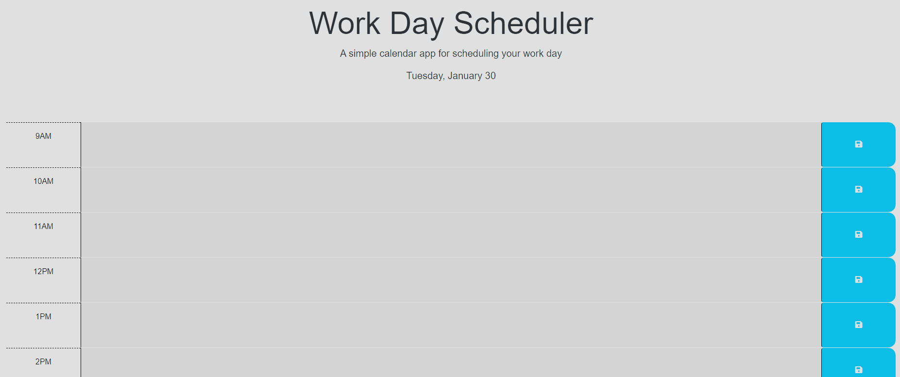

# Nine To Five Scheduler

https://wacwestley30.github.io/NineToFiveScheduler/

## Description

This is my Nine To Five Scheduler that uses Jquery and DayJS. This project taught me how to dynamically use my localStorage and has helped me understand concepts that I was struggling with in previous projects. I was very surprised how nice dayjs was to use after seeing what it would take to do the same thing in regular Javascript.

## Usage

On loading the first time the current time will display in the middle of the page and a series of time blocks. When clicking inside the blocks an event can be added clicking the save button to the side of the block. When the event is saved it is saved to the local storage and a message displays letting the user know the event was saved.

If trying to view the local storage please go to your inspector or right clicking the page and selecting inspect. Going over to the 'Application' tab will show the Local Storage. When you refresh the page anything saved will be rendered to the time block that the text was saved to.

DayJs also compares the current time to the scheduler's nine to five. If the block is in the past the block will be grey. If the block is in the present the block will be red. Finally, if the block is in the future the block will be green.

## Bugs

These are two bugs that I do not really understand why they are appearing and they are kinda rare because they shouldn't be happening in the first place.

The first is that I did in fact want to use ordinals on the current date on the top of the page. The way DayJs is being used in the HTML I cannot get access to the advancedFormat plugin. I have tried require(...) and import without any luck.

The second is every now and then if the time is within an hour (+/-1 hour) sometimes the check will be off. I gave a better discription in the comments but I do not know if that is a daylight savings issue with DayJs or if it is something messing up on certain loads of the page. A refresh normally fixes it. It is just weird that it happens at all.